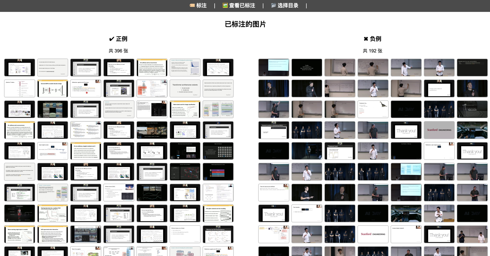

# Course Slides 课程幻灯片提取工具

从在线课程视频中提取PPT幻灯片

## 功能特点
- 自动从视频课程中捕获截图
- 识别和过滤幻灯片内容

## 使用指南

### 1. 视频截图采集
每60秒自动截取一帧视频画面，并按视频标题创建独立目录存储：
```bash
python download_vids.py video_screenshots <视频URL>
```


### 2. 图片标注
启动Web界面进行标注，区分幻灯片与非幻灯片内容。根据命令行提示，访问 http://localhost:5000 ，开始标注工作。
```bash
cd label-tool
python app.py
```

默认选择负例（非幻灯片，比如老师在讲台上，或者老师只展示了一半的PPT）。不选择默认为正例（需要保留的PPT），一次提交可以标注多张图片。


这是已标注的一些图片。5-10分钟能搞定。


### 3. 模型训练
使用标注数据训练二分类模型：
- 打开 `classify.ipynb` Jupyter笔记本
- 按照步骤说明完成模型训练。20%验证集，在mac运行5分钟，能得到一个在验证集上96%正确率的模型。


### 4. 幻灯片筛选
使用训练好的模型筛选幻灯片：
```bash
# 生成筛选结果
python filter_slides.py <原始图片目录>
```


### 5. 查看幻灯片
对应展示每张图片是否是PPT，是否是重复。看不懂PPT的内容时，直接右键copy image，然后去问GPT。


### 6. 内容描述生成（TODO）
使用大语言模型为筛选出的幻灯片生成内容描述：
```bash
python generate_descriptions.py <幻灯片目录>
```
